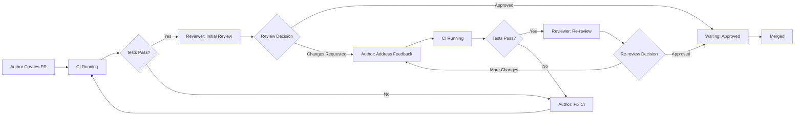

# Core Concepts

This page explains the fundamental concepts behind Ready-to-Review. Understanding these concepts will help you use the system effectively and troubleshoot issues.

## Turn-Based PR Tracking

Ready-to-Review treats pull request reviews like a turn-based game. At any moment, one person (or automated system) is responsible for the next action.

### How It Works

Every pull request is in one of several states:

| State | Whose Turn | What Needs to Happen | Who Gets Notified |
|-------|------------|----------------------|-------------------|
| **Author: Fix CI** | Pull request author | Tests are failing and need to be fixed | Author |
| **Author: Address Feedback** | Pull request author | Reviewers requested changes | Author |
| **Author: Resolve Conflicts** | Pull request author | Merge conflicts need resolution | Author |
| **Reviewer: Initial Review** | Assigned reviewers | Code needs first review | All assigned reviewers |
| **Reviewer: Re-review** | Reviewers who requested changes | Author addressed feedback, needs re-review | Reviewers who requested changes |
| **Waiting: CI Running** | Continuous Integration system | Automated tests are in progress | No one (waiting) |
| **Waiting: Approved** | Repository maintainer or automation | PR is approved, waiting for merge | No one (ready to merge) |

!!! info "State Determination"
    Ready-to-Review determines state by analyzing:

    - CI check status (passing, failing, pending)
    - Review status (approved, changes requested, pending)
    - Merge conflicts
    - Draft status
    - Time since last activity

### Example Flow

Here's how a typical pull request moves through states:



1. **Author creates PR**: New pull request is opened
2. **CI Running**: GitHub Actions, CircleCI, or other CI runs tests (state: Waiting)
3. **Tests fail**: Author is notified to fix tests (state: Author - Fix CI)
4. **Tests pass**: Reviewers are notified (state: Reviewer - Initial Review)
5. **Changes requested**: Author is notified to address feedback (state: Author - Address Feedback)
6. **Author updates**: CI runs again
7. **Tests pass**: Reviewers who requested changes are notified (state: Reviewer - Re-review)
8. **Approved**: PR is ready to merge (state: Waiting - Approved)
9. **Merged**: PR is closed

At each step, **exactly one person or group** knows they are responsible for the next action.

## Smart Notification Logic

Ready-to-Review doesn't just blast notifications to everyone. It uses intelligent logic to notify the right person at the right time.

### Notification Timing

Notifications are sent when:

- **State changes**: PR moves from one state to another (e.g., CI passes, review submitted)
- **Assignment changes**: New reviewers are added or removed
- **Significant time has passed**: Daily reminders if a PR has been waiting >8 hours

Notifications are **not** sent when:

- **PR is in waiting state**: Nobody needs to act (CI running, approved but not merged)
- **User recently notified**: Anti-spam protection prevents duplicate notifications within 1 minute
- **User just took action**: If you just pushed code, you won't be immediately notified about CI running

### Notification Channels

Ready-to-Review can notify via multiple channels. You choose which to enable:

| Channel | Notification Type | When to Use |
|---------|-------------------|-------------|
| **Dashboard** | Always available | Always enabled - check anytime at `<org>.ready-to-review.dev` |
| **Slack DM** | Direct message | User isn't in the channel where PR was posted |
| **Slack Channel** | Channel message | PR affects team or specific project |
| **Goose Desktop** | Native OS notification | Individual developer preference |

### Channel Priority

If multiple notification channels are enabled, Ready-to-Review uses this logic:

1. **Slack channel notification** (if user is in the channel):
    - Post to channel
    - **Wait 65 minutes** before sending DM (configurable)
    - If user doesn't act within 65 minutes, send Slack DM
    - Dashboard always shows PR status

2. **Slack DM** (if user is not in the channel):
    - Send DM immediately
    - Dashboard always shows PR status

3. **Goose desktop notification**:
    - Sent simultaneously with Slack notifications (if Goose is installed)
    - Independent of Slack channel delay

4. **Dashboard only**:
    - If Slack and Goose are not configured, PRs appear in dashboard only
    - No active notifications

!!! tip "Reducing Notification Noise"
    The 65-minute Slack DM delay prevents spam when users are actively monitoring channels. Users who see the channel notification can act immediately without getting redundant DMs.

## Reviewer Assignment Algorithm

The GitHub Reviewer Bot automatically assigns reviewers to new pull requests using a multi-factor algorithm.

### Assignment Factors

Reviewers are scored based on:

1. **Code Ownership** (highest weight):
    - Who last modified the files being changed?
    - Who contributed most to the changed files historically?

2. **Current Workload** (second highest weight):
    - How many open PRs is this person currently reviewing?
    - Are any of those PRs stale (>90 days old)?
    - Reviewers with >9 active PRs are excluded

3. **Activity Patterns** (third highest weight):
    - Is the reviewer currently in their active work hours?
    - Have they been active on GitHub recently?
    - Are they on vacation or out of office?

4. **Expertise** (moderate weight):
    - Do they have domain expertise in the affected code?
    - Have they reviewed similar changes before?

!!! note "Bot Detection"
    The algorithm automatically filters out:

    - Service accounts (e.g., `dependabot`, `renovate`)
    - GitHub Apps and bots
    - Organization accounts (e.g., `@company`)
    - Inactive or deleted users

### Assignment Process

When a new pull request is created:

1. **Analyze changes**: Determine which files were modified
2. **Find contributors**: Use `git blame` to identify who last touched those files
3. **Score candidates**: Assign scores based on factors above
4. **Filter overloaded**: Remove reviewers with too many open PRs
5. **Select top reviewers**: Choose 1-3 reviewers with highest scores
6. **Assign on GitHub**: Add reviewers to the PR
7. **Notify**: Send notifications via configured channels

### Workload Balancing

To prevent reviewer burnout, the algorithm:

- **Excludes** reviewers with >9 non-stale open PRs
- **Counts only recent PRs** - PRs untouched for >90 days are considered stale
- **Distributes load** - if multiple candidates have similar scores, picks the one with fewer open PRs

!!! example "Workload Calculation"
    Alice has 12 open PRs assigned:

    - 3 PRs updated within 90 days (not stale)
    - 9 PRs not updated for >90 days (stale)

    Effective workload: **3 PRs** (stale PRs are ignored)

    Alice is eligible for new assignments.

## Multi-Organization Support

Ready-to-Review can track pull requests across multiple GitHub organizations simultaneously.

### How It Works

Each GitHub organization gets:

- **Independent dashboard**: `<org-name>.ready-to-review.dev`
- **Separate configuration**: Each org has its own `.codeGROOVE/slack.yaml` settings
- **Isolated state tracking**: PRs from different orgs don't interfere

### Cross-Organization Features

If you belong to multiple organizations:

- **Goose Desktop App** shows PRs from all orgs you have access to
- **Organization filtering** lets you focus on specific orgs in Goose
- **Dashboard** requires visiting each org's URL separately

!!! tip "Work vs Personal Projects"
    Use Goose's organization filtering to separate work and personal open-source projects. See [Goose - Configuration](goose.md#organization-filtering).

## Multi-Workspace Slack Support

The Slack integration supports multiple Slack workspaces, even for the same GitHub organization.

### Use Cases

- **Multiple teams**: Engineering in one workspace, DevOps in another
- **Company + Clients**: Your company's Slack workspace plus client workspaces
- **Distributed teams**: Regional teams each with their own Slack workspace

### Configuration

Each Slack workspace has independent configuration:

1. Install the Slack app in each workspace separately
2. Configure `.codeGROOVE/slack.yaml` to specify which workspace(s) receive notifications:

```yaml
global:
    slack: primary-workspace.slack.com
```

See [Slack Integration - Multi-Workspace Setup](slack.md#multi-workspace-setup) for complete configuration.

## Timezone Awareness

Ready-to-Review detects user timezones and schedules notifications during active work hours when possible.

### How Timezone Detection Works

Timezones are detected using:

1. **GitHub activity patterns**: When is this user most active?
2. **Profile analysis**: Does the user's profile list a location?
3. **Commit timestamps**: What timezone are commits made from?
4. **Default**: If timezone cannot be detected, UTC is assumed

### Timezone in Action

**Daily Reminders**: Sent between 8-9am in the user's local timezone

!!! example
    - Alice (US Eastern): Reminded at 8:30am ET
    - Bob (Central Europe): Reminded at 8:15am CET
    - Carol (Tokyo): Reminded at 8:45am JST

**Reviewer Assignment**: Reviewers in active timezones are slightly prioritized over those who are likely offline

## Technical Architecture

For a deep dive into how Ready-to-Review's state machine, notification system, and microservices interact, see the [architectural diagram](https://github.com/codeGROOVE-dev/architecture/blob/main/README.md).

## Next Steps

Now that you understand core concepts:

- Configure your [Dashboard](dashboard.md) view preferences
- Set up [Slack Integration](slack.md) channel mappings
- Install [Goose](goose.md) for desktop notifications
- Learn how [GitHub Reviewer Bot](github-bot.md) assigns reviewers
