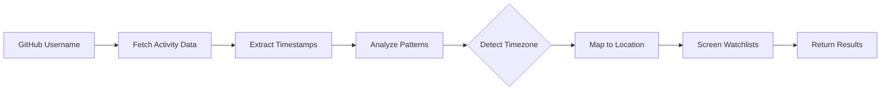
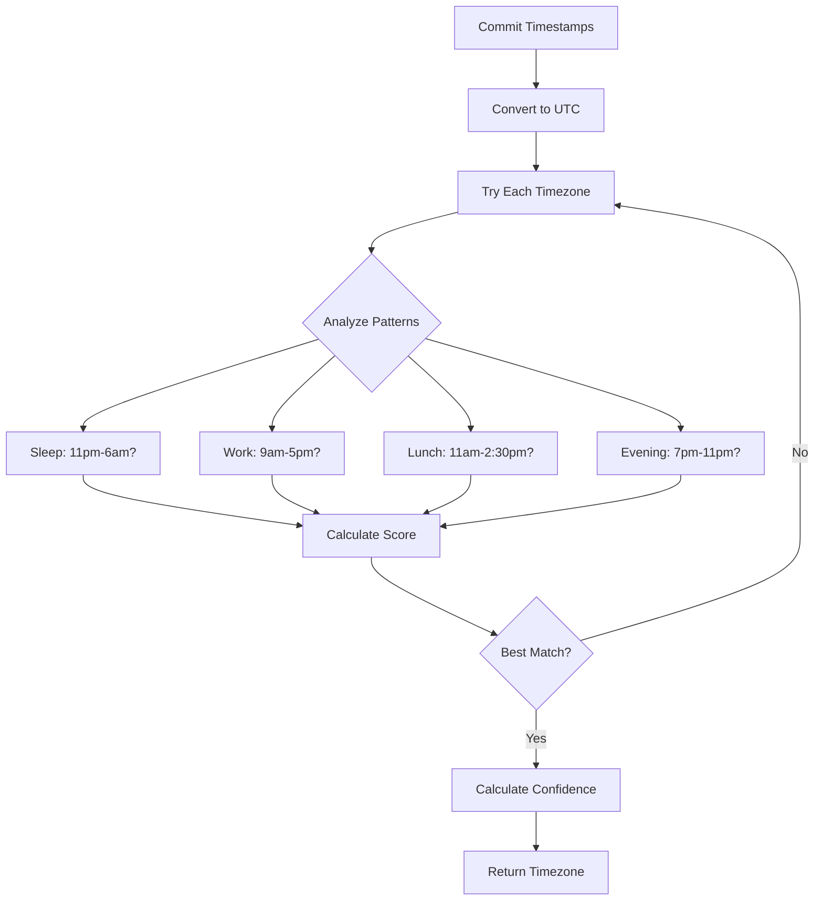

# gitIDENTITY

**Developer threat intelligence.**

---

## The Problem

DPRK operatives have infiltrated hundreds of Fortune 500 companies using fake contractor identities. They claim to be in one location but work from another. Traditional vetting misses this.

## The Solution

gitIDENTITY detects location mismatches through behavioral analysis of GitHub activity patterns. No VPN can hide when you actually work.

[Try the Preview →](https://preview.gitidentity.dev/){ .md-button .md-button--primary }

---

## How It Works

1. **Activity analysis** — Analyze years of GitHub commits, PRs, and comments
2. **Pattern detection** — Identify sleep/work/lunch patterns in local time
3. **Timezone inference** — Determine most likely timezone with confidence score
4. **Geolocation** — Map timezone to country and region
5. **Watchlist screening** — Check against OFAC, BIS, UN/EU sanctions lists

## Detection Algorithm

**Confidence factors**:

- Pattern consistency across months
- Total commits analyzed
- Presence of strong signals (lunch, evening coding)
- Absence of conflicting signals (VPN indicators)

---

## Use Cases

| Use Case | What it detects |
|----------|-----------------|
| **Hiring** | Verify contractor location claims |
| **Security** | Detect nation-state operatives |
| **Compliance** | Screen against sanctions lists |
| **Due Diligence** | Validate OSS contributor identities |

---

## Features

- **Behavioral geolocation** via activity patterns
- **OFAC, BIS, UN/EU sanctions screening**
- **Threat actor archetype detection**
- **Collaborator network analysis**
- **Lunch break detection** (11am-2:30pm validation)
- **Evening activity patterns** (strongest timezone signal)

---

## Status

**Preview** — Currently available for trial use.

- Try individual lookups at [preview.gitidentity.dev](https://preview.gitidentity.dev/)
- Use the [API](api.md) for integration testing
- Contact [recon@codegroove.dev](mailto:recon@codegroove.dev) for enterprise access

---

## Documentation

- [Getting Started](getting-started.md) — Try the preview and API
- [API Reference](api.md) — Integration documentation

Questions? [Get Support](https://codegroove.dev/support)
