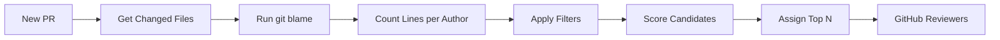
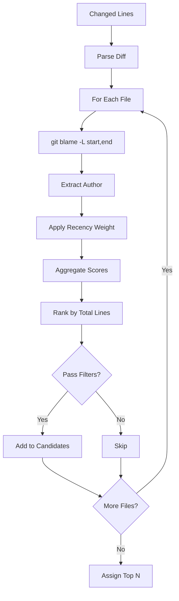

# grooveASSIGN

**The right reviewer, every time.**

**Open Beta** — Currently free for everyone. Always free for open source.

---

## The Problem

- **Wrong reviewers**: CODEOWNERS assigns based on paths, not who actually wrote the code
- **Manual assignment**: Tech leads waste hours triaging PRs
- **Overloaded seniors**: Same people get everything, become bottlenecks

## The Solution

grooveASSIGN automatically assigns developers who actually know the code. Line-level blame analysis, not just file history.

[Install Free →](https://github.com/apps/grooveassign){ .md-button .md-button--primary }

Installs in 30 seconds. Works across your entire org.

---

## How It Works

1. **PR opened** — no reviewers assigned
2. **Blame analysis** — we run `git blame` on changed lines
3. **Candidate scoring** — code ownership, recent activity, current workload
4. **Timing boost** — prefer reviewers likely to be online now
5. **Assignment** — top reviewers assigned (excludes bots, author, overloaded devs)

## Blame Analysis in Detail

**Recency weighting**:

- Last 30 days: 100% weight
- 30-90 days: 50% weight
- 90+ days: 25% weight

### Timing Boost

grooveASSIGN analyzes historical activity patterns to prefer reviewers who are likely available now:

| Availability | Score Adjustment |
|--------------|------------------|
| Active this hour | +30% |
| Active next hour | +20% |
| Active in 2 hours | +10% |
| Not active in 3+ hours | -25% |

This reduces review latency by assigning reviewers in their working hours, not while they're asleep.

---

## Pricing

| Plan | Price | Features |
|------|-------|----------|
| **Free** | $0/forever | Public repos, all features |
| **Team** | $1/user/month | Private repos |

[Get Team →](https://github.com/marketplace/grooveassign){ .md-button }

---

## Documentation

- [Getting Started](getting-started.md)
- [Configuration](configuration.md)

Questions? [honk@codegroove.dev](mailto:honk@codegroove.dev)
