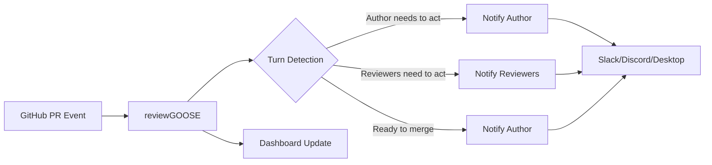
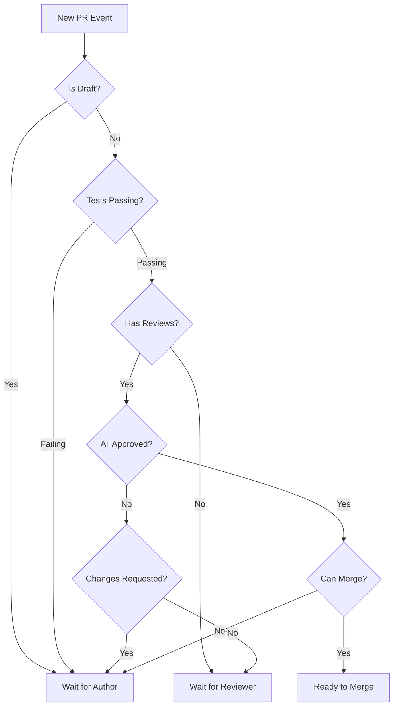

# reviewGOOSE

**PRs that merge in minutes, not days.**

---

## The Problem

Industry average PR merge time is **4.5 days**. Most of that is waiting—unclear whose turn it is, missed notifications, context switching.

## The Solution

reviewGOOSE tracks whose turn it is and notifies the right person at the right time.

[Get Started →](getting-started.md){ .md-button .md-button--primary }

---

## How It Works

1. **GitHub App** monitors your PRs
2. **Turn detection** determines who needs to act: fix tests, review, address feedback, merge
3. **Smart notifications** via Slack DM, channel post, or desktop app
4. **Dashboard** shows PRs organized by "waiting on you" vs "waiting on others"

## Turn Detection Logic

reviewGOOSE determines whose turn it is by analyzing:

- **CI status**: Are tests passing or failing?
- **Review state**: Approved, changes requested, or pending?
- **PR state**: Draft, ready for review, or approved?
- **Merge status**: Mergeable or blocked?

---

## Components

| Component | What it does |
|-----------|--------------|
| [GitHub](github-bot.md) | Connects to your repos |
| [Web](dashboard.md) | Dashboard at `<org>.reviewgoose.dev` |
| [Slack](slack.md) | Channel posts and DMs |
| [Discord](discord.md) | Channel posts and DMs (Preview) |
| [Desktop](goose.md) | Native notifications |

---

## Pricing

Free for public repos. [See Plans](plans.md) for private repos.

Questions? [Get Support](https://codegroove.dev/support)
