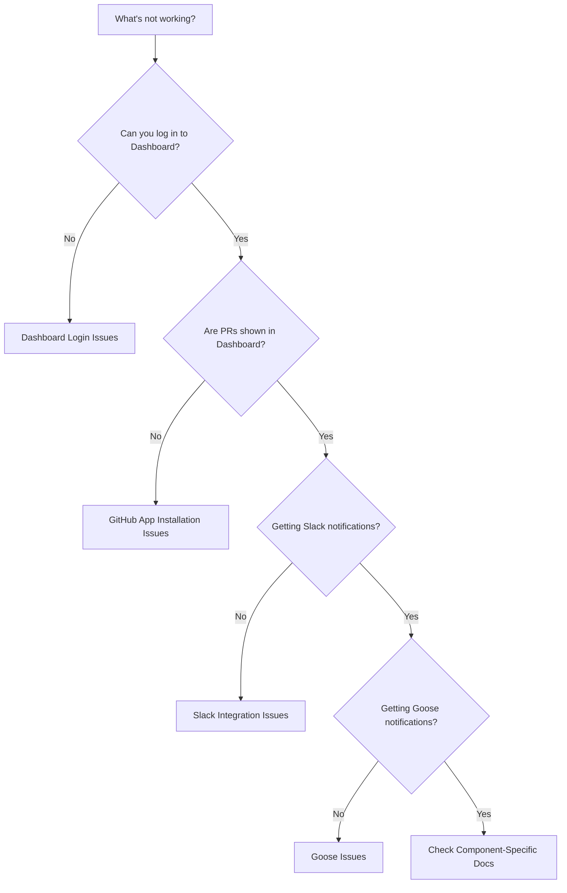

# Troubleshooting

**Part of reviewGOOSE** - [Home](index.md) | [Getting Started](getting-started.md) | [Dashboard](dashboard.md) | [Slack](slack.md) | [Goose](goose.md) | [GitHub Bot](github-bot.md)

This guide provides solutions to common issues across all reviewGOOSE components. For component-specific troubleshooting, see the FAQ sections in each component's documentation.

## Quick Diagnosis

Use this flowchart to identify which component is affected:



## General Issues

### I'm not sure if reviewGOOSE is working

**Diagnostic procedure**:

1. **Check the Dashboard**:
    - Navigate to `<your-org>.reviewgoose.dev`
    - Log in with GitHub
    - Do you see any PRs listed?

2. **Create a test PR**:
    - Make a small change in a monitored repository
    - Create a pull request
    - Wait 60 seconds

3. **Verify each component**:
    - **Dashboard**: Refresh and check if PR appears
    - **Slack**: Check configured channel for message
    - **Goose**: Check for desktop notification

If any component fails, proceed to that component's troubleshooting section below.

### Nothing works after installation

**Possible causes**:

1. **GitHub App not properly installed**
2. **Repository access not configured**
3. **Waiting for initial sync**

**Solutions**:

1. **Verify GitHub App installation**:
    - Go to [GitHub Settings → Installed GitHub Apps](https://github.com/organizations/<your-org>/settings/installations)
    - Find "reviewGOOSE"
    - Verify it shows "Installed" status
    - Check "Repository access" includes your repositories

2. **Wait for initial sync**:
    - After installation, allow up to 60 seconds for data to sync
    - Refresh the Dashboard

3. **Check service status**:
    - [Check Service Status →](https://github.com/codeGROOVE-dev/support/issues/new?template=support-request.md){ .md-button }

### PRs are not being tracked

**Symptoms**: Pull requests exist but don't appear in reviewGOOSE.

**Solutions**:

1. **Verify repository is monitored**:
    - Go to [GitHub Settings → Installed GitHub Apps](https://github.com/organizations/<your-org>/settings/installations)
    - Click "Configure" on reviewGOOSE
    - Under "Repository access":
        - If "All repositories": All repos should be monitored
        - If "Only select repositories": Verify your repo is in the list

2. **Check repository visibility**:
    - Free plan only supports public repositories
    - Private repos require Pro or Flock: See [Plans](plans.md)

3. **Verify PR is not a draft**:
    - Draft PRs are tracked but not assigned reviewers
    - Mark PR as ready for review

4. **Force a refresh**:
    - Close and reopen the PR
    - This triggers a full resync

## GitHub App Issues

### GitHub App installation failed

**Symptoms**: Error during GitHub App installation or configuration.

**Solutions**:

1. **Verify permissions**:
    - You need **Organization Owner** or **Admin** role
    - Go to [GitHub Organization Members](https://github.com/orgs/<your-org>/people)
    - Verify your role

2. **Check organization settings**:
    - Some organizations restrict GitHub App installations
    - Go to [Organization Settings → Third-party access](https://github.com/organizations/<your-org>/settings/oauth_application_policy)
    - Verify third-party applications are allowed

3. **Try installation again**:
    - Go to [reviewGOOSE Real-Time GitHub App](https://github.com/apps/reviewgoose-real-time)
    - Click **Configure** (if previously installed) or **Install**
    - Follow installation steps

4. **Contact GitHub Support**:
    - If installation repeatedly fails, this may be a GitHub issue
    - Contact [GitHub Support](https://support.github.com/)

### GitHub App was accidentally removed

**Symptoms**: reviewGOOSE stopped working after someone removed the GitHub App.

**Solutions**:

1. **Reinstall the GitHub App**:
    - Go to [reviewGOOSE Real-Time GitHub App](https://github.com/apps/reviewgoose-real-time)
    - Click **Install**
    - Select repositories
    - Click **Install**

2. **Verify data recovery**:
    - PRs should reappear in the Dashboard within 60 seconds
    - Historical data is retained for 28 days

### I don't have permission to install the GitHub App

**Symptoms**: "You don't have permission" error when trying to install.

**Solutions**:

1. **Ask an organization owner**:
    - Only organization owners and admins can install GitHub Apps
    - Contact your organization owner to install
    - Provide this documentation link

2. **Request permissions**:
    - If you believe you should have permissions, ask the org owner to promote you
    - Go to [GitHub Organization Members](https://github.com/orgs/<your-org>/people)

## Dashboard Issues

### Can't log in to Dashboard

See [Dashboard - Troubleshooting](dashboard.md#troubleshooting) for detailed solutions.

**Quick fixes**:

1. Clear browser cookies for `*.reviewgoose.dev`
2. Try incognito mode
3. Verify GitHub OAuth authorization
4. Check organization membership

### Dashboard shows no PRs

See [Dashboard - Troubleshooting](dashboard.md#troubleshooting) for detailed solutions.

**Quick fixes**:

1. Verify GitHub App installation
2. Check repository access (public vs private)
3. Force refresh (Ctrl+Shift+R / Cmd+Shift+R)
4. Wait for initial sync (60 seconds)

### Dashboard is slow

See [Dashboard - Troubleshooting](dashboard.md#troubleshooting) for detailed solutions.

**Quick fixes**:

1. Clear browser cache
2. Use repository filtering to reduce load
3. Try a different browser
4. Check internet connection

## Slack Integration Issues

### Slack app not posting to channels

See [Slack Integration - Troubleshooting](slack.md#troubleshooting) for detailed solutions.

**Quick fixes**:

1. Verify Slack app installation (Slack → Apps → Manage)
2. Check channel configuration (in your `.codeGROOVE` repository's `slack.yaml` file)
3. Invite bot to channel: `/invite @reviewGOOSE`
4. Verify workspace URL in configuration
5. Create test PR and wait 60 seconds

### Not receiving Slack DMs

See [Slack Integration - Troubleshooting](slack.md#troubleshooting) for detailed solutions.

**Quick fixes**:

1. Check Slack notification settings (not muted)
2. Verify email match (GitHub email = Slack email)
3. Check DM delay (default 65 minutes if in channel)
4. Verify bot can send DMs: `/goose help`

### Too many Slack notifications

See [Slack Integration - Troubleshooting](slack.md#troubleshooting) for detailed solutions.

**Quick fixes**:

1. Increase DM delay: `reminder_dm_delay: 120`
2. Disable daily reminders: `daily_reminders: false`
3. Mute noisy channels: `mute: true`
4. Use repository filtering

## Goose Desktop App Issues

### Goose icon not appearing

See [Goose - Troubleshooting](goose.md#troubleshooting) for detailed solutions.

**Quick fixes by platform**:

=== "macOS"
    1. Check if running: `ps aux | grep -i goose`
    2. Restart: `killall goose && make run`
    3. Check menu bar settings
    4. Reinstall: `make clean && make run`

=== "Linux"
    1. Verify system tray support
    2. Check dependencies: `libgtk-3-dev`, `libappindicator3-dev`
    3. Restart: `killall goose && ./goose`

=== "Windows"
    1. Check hidden system tray icons (up arrow)
    2. Restart via Task Manager
    3. Run as administrator

### No Goose notifications

See [Goose - Troubleshooting](goose.md#troubleshooting) for detailed solutions.

**Quick fixes**:

1. Check OS notification permissions
2. Verify PRs exist (click Goose icon)
3. Create test PR and wait 60 seconds
4. Check system volume (for audio notifications)

### Goose authentication failed

See [Goose - Troubleshooting](goose.md#troubleshooting) for detailed solutions.

**Quick fixes**:

1. Verify GitHub CLI auth: `gh auth status`
2. Re-authenticate: `gh auth login`
3. Check token permissions (if using `GITHUB_TOKEN`)
4. Regenerate token

## Notification Issues

### Not receiving any notifications

**Systematic check**:

1. **Dashboard**: Can you see PRs at `<org>.reviewgoose.dev`?
    - If no: [GitHub App Issues](#github-app-issues)
    - If yes: Continue to step 2

2. **Slack**: Did you install the Slack integration?
    - If no: Notifications will only appear in Dashboard and Goose
    - If yes: [Slack Integration Issues](#slack-integration-issues)

3. **Goose**: Did you install Goose?
    - If no: Notifications will only appear in Dashboard and Slack
    - If yes: [Goose Desktop App Issues](#goose-desktop-app-issues)

### Receiving duplicate notifications

**Symptoms**: Getting notified multiple times for the same PR event.

**Possible causes**:

1. **Multiple notification channels enabled**: Slack + Goose both notify (this is expected)
2. **Misconfigured Slack channels**: PR posted to multiple channels

**Solutions**:

1. **If Slack + Goose**:
    - This is normal behavior - you'll get both
    - Disable one if you prefer single-channel notifications

2. **If duplicate Slack messages**:
    - Check `.codeGROOVE/slack.yaml` for overlapping channel configurations
    - Look for wildcard `"*"` in multiple channels
    - See [Slack Integration - Custom Mapping](slack.md#custom-mapping)

### Notifications are delayed

**Symptoms**: Notifications arrive minutes or hours late.

**Expected behavior** (with GitHub App installed):

- **Dashboard**: Under 1 second
- **Slack**: Under 1 second
- **Goose**: Under 1 second
- **Slack DM delay**: 65 minutes if user is in channel (configurable)

**If notifications are delayed beyond this**:

1. **Check GitHub webhook delivery**:
    - Go to [Repository Settings → Webhooks](https://github.com/<org>/<repo>/settings/hooks)
    - Find reviewGOOSE webhook
    - Check "Recent Deliveries" for failures

2. **Check service status**:
    - Rare outages may delay notifications
    - [Get Support →](https://github.com/codeGROOVE-dev/support/issues/new?template=support-request.md){ .md-button }

3. **Slack workspace issues**:
    - Check [Slack Status](https://status.slack.com/)
    - Slack outages may delay DMs

## Configuration Issues

### YAML configuration not working

**Symptoms**: `.codeGROOVE/slack.yaml` changes don't take effect.

**Common mistakes**:

1. **File location**: Must be `.codeGROOVE/slack.yaml` in repository root (note the leading dot)

2. **YAML syntax errors**:
    ```yaml
    # ❌ Wrong - tabs used for indentation
    channels:
    	engineering:  # This is a tab
    		repos:
    			- myrepo

    # ✅ Correct - spaces used for indentation
    channels:
        engineering:  # This is 4 spaces
            repos:
                - myrepo
    ```

3. **Incorrect workspace URL**:
    ```yaml
    # ❌ Wrong - includes https://
    slack: https://myworkspace.slack.com

    # ✅ Correct
    slack: myworkspace.slack.com
    ```

4. **Typos in repository names**:
    ```yaml
    # Repository names are case-sensitive
    channels:
        engineering:
            repos:
                - api-sever  # ❌ Typo: should be "api-server"
    ```

**Debugging YAML**:

1. **Validate YAML syntax**:
    - Use [YAML Lint](https://www.yamllint.com/)
    - Paste your configuration and check for errors

2. **Test with minimal configuration**:
    ```yaml
    global:
        slack: myworkspace.slack.com

    channels:
        test-channel:
            repos:
                - "*"
    ```

3. **Verify file is committed**:
    ```bash
    git ls-files | grep .codeGROOVE
    ```
    Should output: `.codeGROOVE/slack.yaml`

4. **Check file permissions**:
    - File must be readable (not too restrictive permissions)

## Performance Issues

### High resource usage (Goose)

**Symptoms**: Goose uses excessive CPU or memory.

**Solutions**:

1. **Reduce polling frequency** (future feature - currently fixed at 5 minutes)

2. **Filter organizations**:
    - Click Goose icon → Organization Filter
    - Disable organizations you don't need to monitor

3. **Check for memory leaks**:
    - Restart Goose daily (or use auto-start on login to restart on reboot)
    - [Report Issue →](https://github.com/codeGROOVE-dev/support/issues/new?template=support-request.md){ .md-button }

### Dashboard slow with many PRs

**Symptoms**: Dashboard takes >5 seconds to load.

**Solutions**:

1. **Use repository filtering**:
    - Filter to specific repositories instead of viewing all at once

2. **Close stale PRs**:
    - Close or merge PRs that have been open for >90 days
    - Reduces dashboard load

3. **Contact support**:
    - Flock customers get priority support
    - See [Plans](plans.md)

## Getting Additional Help

If your issue isn't covered here:

1. **Check component-specific documentation**:
    - [Dashboard Troubleshooting](dashboard.md#troubleshooting)
    - [Slack Integration Troubleshooting](slack.md#troubleshooting)
    - [Goose Troubleshooting](goose.md#troubleshooting)
    - [GitHub Bot Troubleshooting](github-bot.md#troubleshooting)

2. **Open a support issue**:

    [Get Support →](https://github.com/codeGROOVE-dev/support/issues/new?template=support-request.md){ .md-button }

    Include:
    - Component affected (Dashboard, Slack, Goose, GitHub Bot)
        - Steps to reproduce
        - Expected behavior
        - Actual behavior
        - Screenshots (if applicable)

### Information to Include in Support Requests

When opening a support issue, please provide:

**For all issues**:

- Component(s) affected
- Plan tier (Free, Pro, or Flock)
- GitHub organization name
- Steps to reproduce

**For Dashboard issues**:

- Browser and version
- Operating system
- URL you're accessing
- Any error messages

**For Slack issues**:

- Slack workspace URL
- Repository name
- Contents of `.codeGROOVE/slack.yaml` (if applicable)
- Channel name where messages should appear

**For Goose issues**:

- Operating system and version
- Installation method (Homebrew, source build)
- Error messages from terminal
- Output of `gh auth status`

**For GitHub Bot issues**:

- Repository name
- PR URL
- Who was assigned (if anyone)
- Who you expected to be assigned

## Maintenance & Status

### Service Status

To check if reviewGOOSE services are operational:

1. [Check Service Status →](https://github.com/codeGROOVE-dev/support/issues/new?template=support-request.md){ .md-button }
2. Check recent issues for outage reports

### Planned Maintenance

Planned maintenance windows will be announced:

- [Get Support →](https://github.com/codeGROOVE-dev/support/issues/new?template=support-request.md){ .md-button }
- At least 48 hours in advance
- Typically during low-traffic hours (weekends, late night US time)

## Next Steps

- Review [Core Concepts](concepts.md) to better understand how reviewGOOSE works
- Check [Security & Privacy](security.md) for security-related questions
- Read component-specific documentation for detailed configuration options
